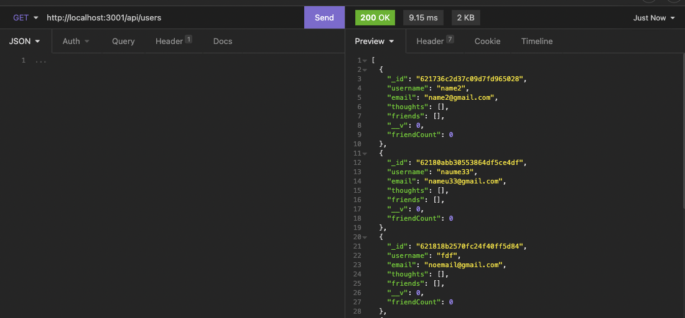
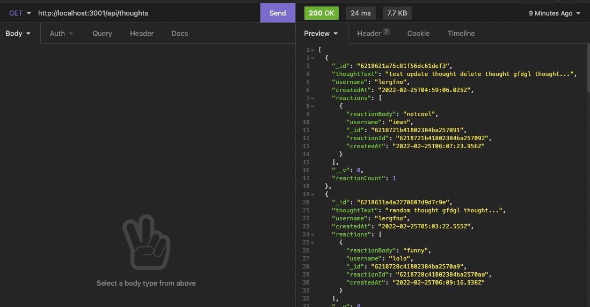
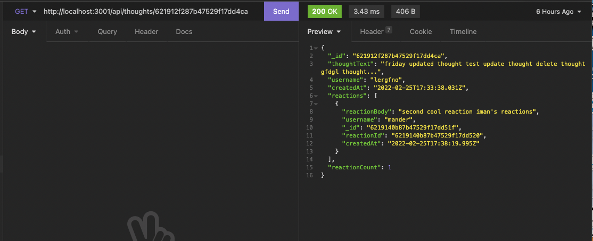
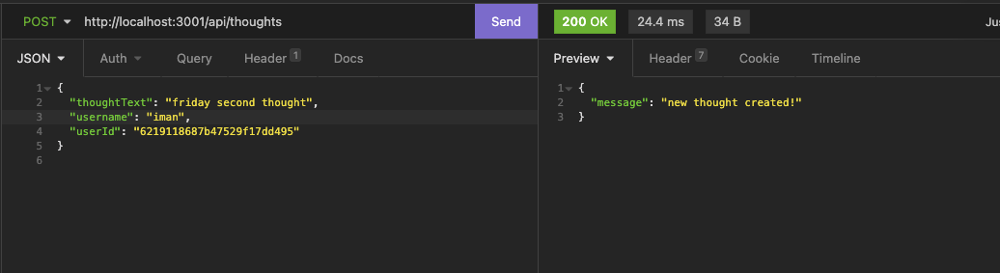
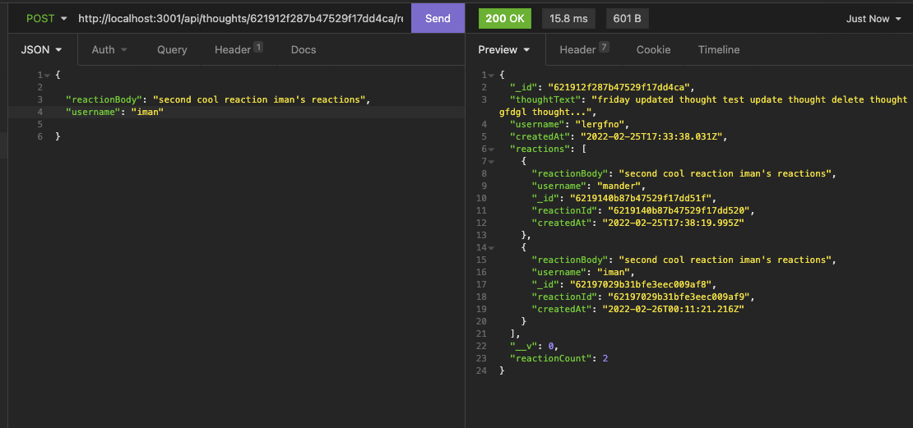
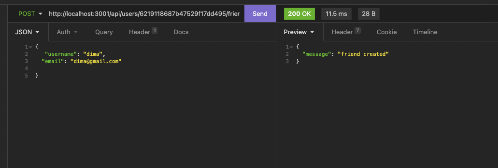

# Social-network-API

## Table of Contents

- [Social-network-API](#social-network-api)
  - [Table of Contents](#table-of-contents)
  - [Description](#description)
  - [Installation](#installation)
  - [Modals](#modals)
  - [Usage](#usage)
  - [Built With](#built-with)
  - [Author](#author)
  - [License](#license)

## Description

This API is built for a social network web application where users can share their thoughts, react to friends’ thoughts, and create a friend list. Builts with Express.js for routing, MongoDB database, and the Mongoose ODM.

## Installation

- Go to the app's [repo](https://github.com/imanmansour86/social-network-API) in github and clone the app

- From terminal: navigate to app's directoty and run:

  ```md
  $ npm install
  ```

- To invoke the app from terminal, run:

  ```md
  $ npm start
  ```

## Modals

The API has 3 models: User, Thought and Reaction. The User model has username, email, thoughts(array of \_id values referencing the Thought model) and friends(array of \_id values referencing the User model). The Thought has thoughtText, createdAt, username and reactions(array of nested documents created with the reactionSchema). The Reaction schema has reactionId, reactionBody, username and createdAt. It is used as the reaction field's subdocument in the Thought model. The following images show the models using MongoDB Compass

- User Model


- Thought Model


- Reaction Model


## Usage

To test the functionality of the routes, open Insomnia, specifiy the method in the request and enter the URL to be tested. Below are some screenshots demonstrating testing the routes in Insomnia

GET routes

- GET Users: `http://localhost:3001/api/users`



- GET User by id: `http://localhost:3001/api/users/:userId`


- GET Thoughts: `http://localhost:3001/api/thoughts`



- GET Thought by id: `http://localhost:3001/api/users/:thoughtId`



POST routes

- POST Thought: `http://localhost:3001/api/thoughts`



- POST Reaction: `http://localhost:3001/api/thoughts/:thoughtId/reactions`



- POST Friend: `http://localhost:3001/api/users/:userId/friends/:friendId`



## Built With

- [MongoDB](https://docs.mongodb.com/)
- [Mongoose](https://www.npmjs.com/package/mongoose)
- [Expressjs](https://expressjs.com/)

## Author

Iman Mansour

- [Portfolio](https://imanmansour86.github.io/new-portfolio/)
- [Github](https://github.com/imanmansour86)
- [LinkedIn](https://www.linkedin.com/in/iman-mansour-51391515/)
- [Email](mailto:imanmansour86@gmail.com)

## License

This project is licensed under the MIT License
